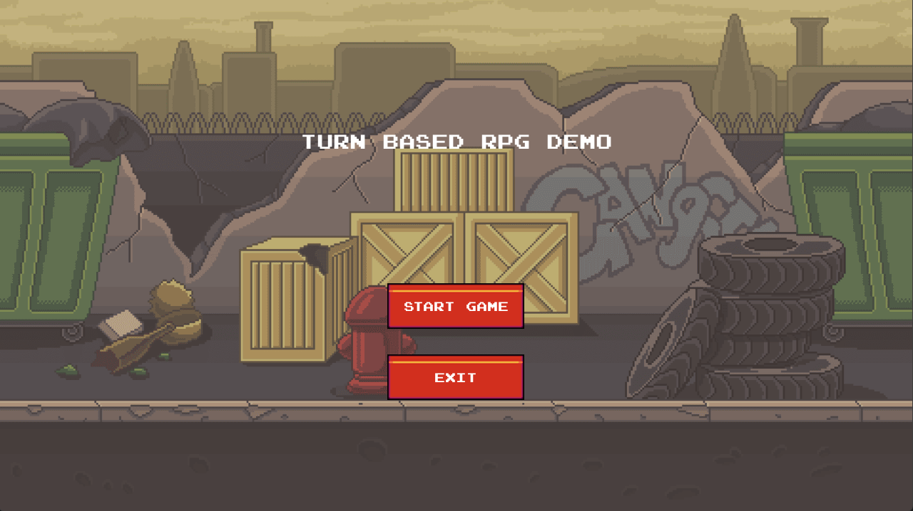
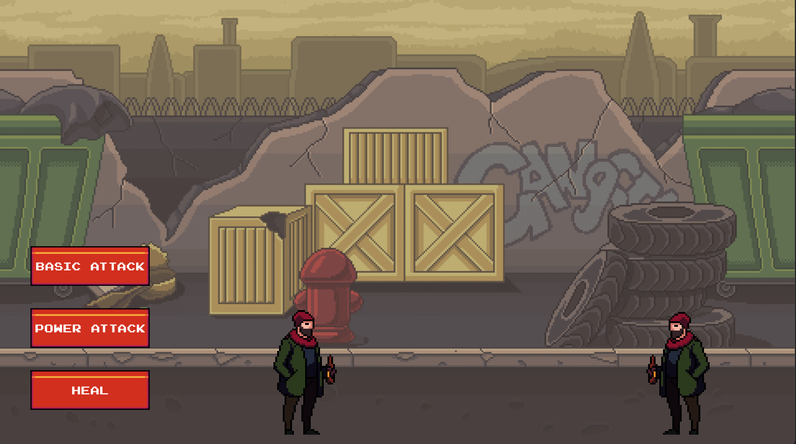

This project is a turn-based RPG game built with Python and Pygame. It features dynamic animations, strategic gameplay mechanics, and an immersive user experience.

## Features

- **Turn-Based Combat**: Players take turns to choose actions such as basic attack, power attack, or heal.
- **Dynamic Animations**: Characters and opponents have fluid, sprite-based animations for various actions.
- **Interactive UI**: Custom buttons, text wrapping, and dialogue boxes enhance the game interface.
- **Unique Abilities**:
  - **Basic Attack**: Standard attack to deal damage.
  - **Power Attack**: High-damage attack at the cost of player health.
  - **Heal**: Recover a portion of the player's health during combat.
- **AI Opponent**: An enemy system that selects its actions dynamically during its turn.
- **Dialogue System**: Displays tutorial dialogues to guide players through game mechanics.

## Screenshots


## Installation

1. Clone the repository:
   ```bash
   git clone https://github.com/your-username/pygame-turn-based-rpg.git
   cd pygame-turn-based-rpg
